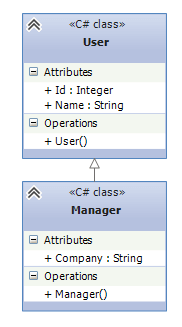
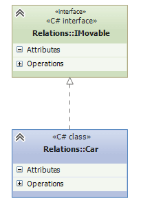
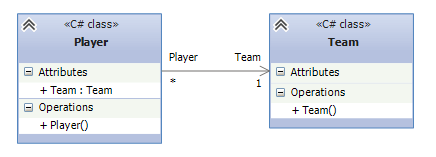
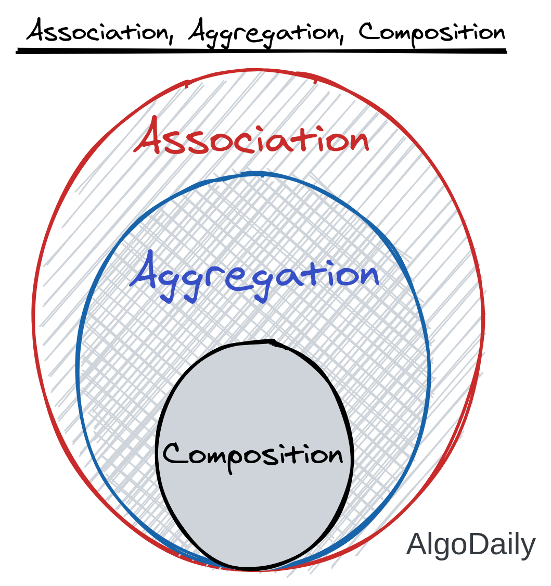
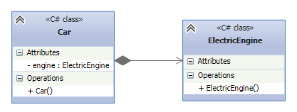
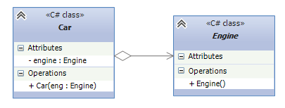

- materials
    - videos
    - https://www.youtube.com/watch?v=ZQpFBAA8a9w
    - https://www.youtube.com/watch?v=mZ_RU3fCOq4
    - https://www.youtube.com/watch?v=8f93GBIdQ1o
    - articles
    - https://metanit.com/sharp/patterns/1.2.php
    - https://www.bestprog.net/ru/2018/10/03/reusing-code-in-java-the-concept-of-composition-inheritance-delegation-the-keyword-extends-examples_ru/
    - https://javarush.com/groups/posts/1265-koncepcii-obhhektno-orientirovannogo-programmirovanija-java
    - https://www.linkedin.com/pulse/types-relationships-object-oriented-programming-oop-sarah-el-dawody/

## Отношение между классами

**Типы отношения между классами:**

- `наследования`, `реализация`, `ассоциация`, `композиция`, `агрегация`,

**Type relationship:**

- Inheritance:
    - `is-a`;
    - Subclass `is` SuperClass
- Association:
    - `has-a`, `uses`, `содержит`;
    - ClassA `has` ClassB
- Aggregation:
    - `has-a`, `содержит`;
    - ClassA `has` ClassB
- Composition:
    - `has-a`, `part-of`, `owns-a`, `содержит`;
    - ClassA `has` ClassB
    - ClassB `is a part of` ClassA

### Наследование

_UML:_

- С помощью диаграмм UML отношение между классами выражается в незакрашенной стрелочке от класса-наследника к
  классу-родителю:
- 

_keywords:_

- Наследование, Расширение, Обобщение
    - inheritance, Extension, generalization
- Является, Расширяет, наследует
    - is, extends, inherits

_Type relationship_:

- Inheritance is a `is-a` type relationship.

```java
class A {

}

class B extends A {

}
```

**Interface**

_UML:_

- С помощью диаграмм UML отношение реализации также выражается в незакрашенной стрелочке от класса к интерфейсу, только
  линия теперь пунктирная:
- 

_keywords:_

- реализация
    - implement
- реализует
    - realizes

_Type relationship_:

- Interface is a `implements the contract` type relationship.
- Interface is a `provides specification` type relationship.

_code:_

```java
interface I {

}

class A implements I {

}
```

**Ассоциация:**

_UML:_

- На схемах UML ассоциация обозначается в виде обычно стрелки:
- 



_terminology_

- Это отношение, при котором объекты одного типа неким образом связаны с объектами другого типа.
- Предпологает наличие связей между объектами, а композиция и агрегация делают эту связь более
  конкретизированной
- Ассоциация бывает разные отношения с объектом: `один ко многим`, `бинарным`
- Агрегация и композиция являются частными случаями ассоциации.

_keywords:_

- имеет, содержит, состоит из
    - has, contains, consists of

_Type relationship_:

- Association is a `has-a` type relationship.

_code:_

```java

class Team {}

class Player {

  public Team team;

}
```

**Композиция:**

_UML:_

- На диаграммах UML отношение композиции проявляется в обычной стрелке от главной сущности к зависимой, при этом со
  стороны главной сущности, которая содержит, объект второй сущности, располагается закрашенный ромбик:
- 

_terminology_

- Основной объект полностью контролирует жизненный цикл объектов от которых он зависит.
- Имеет более строгую связь

Composition

- Is a "part-of" type of relationship, and is a strong type of association.

_keywords:_

- имеет, содержит, состоит из
    - has, contains, consists of

_Type relationship_:

- Association is a `has-a` type relationship.

_code:_

```java
class A {

}

class B {

  public A a;

  public B() {
    //управляем жизненным циклом переменного экземпляра А и поэтому имеет более строгую связь
    a = new A();
  }

}
```

**Агрегация:**

_UML:_

- Отношение агрегации на диаграммах UML отображается также, как и отношение композиции, только теперь ромбик будет
  незакрашенным:
- 

_terminology_

- похоже на композицию, только зависимости создаются вне основного объекта
- Имеет менее строгую связь

Aggregation

- Is a "has-a" type relationship and is a one-way form of association.

_keywords:_

- имеет, содержит, состоит из
    - has, contains, consists of

_Type relationship_:

- Association is a `has-a` type relationship.

_code:_

```java
class A {

}

class B {

  public A a;

  public void setA(A a) {
    //переменный Экземпляр А присвает значения из внешнего Объекта и поэтому имеет менее строгую связь
    this.a = a;
  }

}
```

**Делегирование:**

- Делегирует свои аспекты поведения = Это значит что отдал свои поведения другим классам а у себя оставил только ссылку
  к нему через переменную и вызывает уже в поведении саму ссылку. То есть весь алгоритм или логика была вынесена за
  пределы класса и теперь в этом методе остается вызов ссылки где теперь реализован алгоритм или логика
- Делегирует - это значит что отдает свои полномочия другим.

```java
class A {

  public void call() {
    System.out.println("call");
  }

}

class B {

  A a = new A();

  call() {
    // называется делегированием когда логику вынесли в отдельный класс а здесь мы вызываем через переменную экземпляра класса А
    a.call();
  }

}

```


